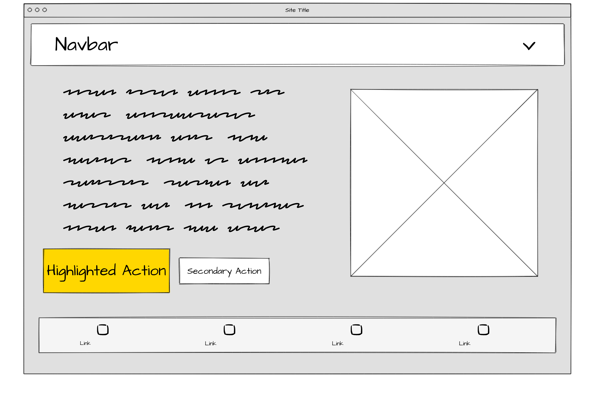

1. FlexBox exercises
2. UX/UI exercises
3. Questions:
`¿Qué es un objetivo primordial?`:
A prime objective is the main goal of the user experience from a characteristic or characteristics which define the main app.  

`¿Qué son los wireframes de baja fidelidad?`:  
These are constructors when designing the user experience in order to
configure a basic appareance-structure needed. The UX foundation, to be
shown/materialised, needs to be shown throught the elements.  

`¿Qué es Git y para qué sirve?`
It's a DVSC which let collaborative workin by using local copies of a development, on which each part of a development team can work at their own/on their specific part, then, merging/updating their result to the main branch.  

`¿Qué es un mapa del sitio?`:  
In UX designing process a sitemap helps providing a step-by-step functions definitions (explanations) by using many different resources/tools as flowcharts. So that a sitemap diagrams  minuciously define the work data flow and process.

`Nombra tres valores que se pueden usar con flex-direction, incluido el valor predeterminado que usa flexbox cuando se crea.`
* row /* defult vale */
* column
* flex-start
* flex-end
------

UI/UX Assignment:
Task01: Wireframe for an index:  

Task 02: Identified colours:  

https://sebkay.com/ 

- rgb(0 0 0 / .1) for box-shadows. 
A black with low Alpha is a widely used colour resource; it contrasts with the branding colour chart used for each content platform:  
- #f9322c for Larabel highlighted word.  
- #41b883 for Vue.  
- #0073aa for WordPress thing.  
- rgb(14 165 233) for TailWind.  

Task 03: User Story of "Youtube".

La user story de Youtube está basada en profundos algortimos y complejas métricas.

- La acción básica es tan sencilla como clickar un enlace, y dicho contenido se reproduce automaticamente en una nueva ventana (o en un picture-in-picture, es decir, el propio video solapado en un lateral de la pantalla permitiendo al usuario seguir interactuando con la plataforma, cambiar de páginas, sin afectar a la reproducción y visibilidad del vídeo).

- Para poder dar forma a las métricas y algortimos, el usuario debe utilizar una cuenta personal que lo identifique respecto a cualquier otro usuario en la plataforma, utilizando para ello una cuenta Google típica.

- El usuario puede generar una lista de recomendaciones en base a su historial de navegación a través del algortimo de la plataforma, de hecho, es una acción automatizada que no supone realizar una acción concreta por parte del usuario más allá de, simplemente, utilizar la plataforma.

- El usuario también puede generar listas de reproducción personalizadas en base a etiquetas, contenidos afines, etc.

- Por último, el usuario tiene la opción de buscar el contenido a través de la barra de búsquedas.

Respecto a la interacción con el contenido, la experiencia de usuario:
- El usuario puede mostrar su apoyo al creador del contenido a traves de distintas interacciones, como mostrar un "Me Gusta", suscribirse a su contenido del cual recibirá notificaciones o a través de comentarios.
- Además del apoyo, en positivo, se ofrece la posibilidad de mostrar crítica a través de la reversa del "Me gusta" (un botón de "no me gusta"), o a través de la expresión escrita en Comentarios.
- Las emisiones en directo por parte de los creadores de contenido permiten un nivel de apoyo superior al integrar chats en paralelo a la emisión, con la posibilidad de poder destacar lo que un usuario quiere expresar.
- A propósito de la interacción del usuario para reforzar su apoyo, la plataforma explota, con fines lucrativos, la posibilidad de mostrar "un apoyo aún superior" al creador de contenido a través de interacciones pagadas, es decir, que requieren desembolsar una cantidad de dinero, siendo estas interacciones descatacas por encima de las del resto.  
Y, yendo un paso más allá, también se explota economicamente la sensación de "pertenencia al grupo"-pertenencia a "un algo" permitiendo al usuario destacar su propia membresía como seguidor a través de membresías pagadas, satisfaciendo así (de una manera ciertamente desequilibrada) dicha necesidad básica.

- El usuario también puede "pasar al otro lado" y comenzar a desarrollar y distribuir su propio contenido a la plataforma, o crearlo desde las propias herramientas integradas en esta.

- El creador de contenido puede recibir diversas métricas que analizan un amplio rango de datos relacionados, por ejemplo, cómo se sigue su contenido, de qué preferencias dispone para con sus usuarios, desde qué punto geográfico es seguido, qué parte de su contenido recibe mayores o menores interacciones.

Todo esto lleva al principio del user-story de Youtube, haciendo un círculo perfecto de acciones-retroalimentación.

Task04: Objetivo Primordial de ...   
- Twitter: En sus inicios, permitir expresar de manera concisa y breve un pensamiento sin ser interferido por complejos editores de estilo/text, de manera directa. Visto de otro modo, hacer esclavo de sus palabras a a cualquiera dispuesto a teclear 160 caracteres.

- Facebook: Mantener el contacto con colegas académicos reforzando la "permanencia a un u otro grupo académico" a través de interacciones multimedia (Foto, video, texto, objetivos en juegos integrados, etc...).

- Google: Como buscador, indexar contenido a través de keywords para posteriormente ser mostrado con preferencia sobre otro contenido similar previo pago por parte de sus autores.  
Como empresa (Hoy día Alphabet), hacer de absolutamente todo un perfil para cada anuncio y un anuncio para cada perfil.

- Youtube: Visualizar contenido audiovisual a través de una plataforma unificada que potencia la interacción entre creadores y público.
