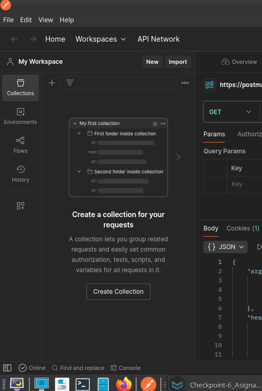
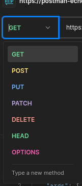
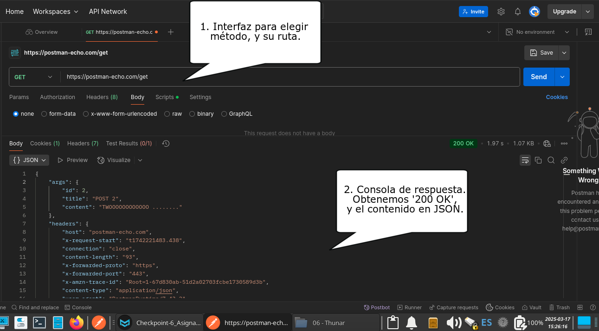

# Checkpoint 06: Documentación Python

### Date:        March 18th, 2025.

##### Student:        Alexandr Gomez

---

## 1)    ¿Para qué usamos Clases en Python?

En lenguajes de programación orientado a objetos como Python básicamente trabajamos con objetos y clases.

Si los objetos pueden ser cualquier tipo de dato a introducir, a procesar, o ya procesado, las Clases son sus "normas", sus "guías sobre cómo deben ser procesados" dichos objetos y sus atributos.

Por ejemplo, queremos manejar una pequeña base de datos en la que tenemos distintos elementos, como usuarios, contraseñas, sus números de ficha en nuestra base de datos, sus permisos en el sistema.

Cada objeto de dicha lista debe ser manejado según especificaciones diferentes.  
Por ejemplo, tal vez queramos poder sobreescribir algunos de los elementos de cada ficha (como los permisos, o la contraseña) pero otros no, (como el identificador de ficha, el nombre de usuario).

También es posible que queramos también añadir diferencias entre quién puede modificar algunos de esos datos sí modificables (como el administrador del sistema, pudiendo modificar permisos, el identificador de ficha) y quién no (el propio usuario, que sólo podría, por ejemplo, modificar su contraseña y algunos de sus datos personales, no esenciales para el funcionamiento de nuestra aplicación y base de datos).

Pero, además, queremos que nuestra base de datos se muestre en un framework en front-end, con unas especificaciones de construcción (de proyección de los datos) muy concreta.

Para esto están las Clases.

Ejemplo:

```python
class Usuario:

    def __init__(self, user, psswd, ident):

        self.user = user
        self.passwd = psswd
        self._ident = ident

    # Añadimos un dunder string para formar la constucción
    def __str__(self):
        return f'\n Registro de Control de Accesos\n\nEl usuario {self._ident}: "{self.user}" \nTiene asignada la contraseña: {self.passwd}\n'
```

[Man Doc oficial de Clases en Python](https://docs.python.org/3/tutorial/classes.html)

****

## 2)    Qué método se ejecuta automáticamente cuando se crea una instancia de una clase?

Cuando creamos una instancia de Clase, el primer método que se ejecuta automaticamente es `__init__`.  

Es el método conocido como Constructor de la clase y se utiliza para inicializar los atributos del objeto.

Ejemplo:

```python
class Usuario:
    def __init__(self, user, psswd, ident):
        self.user = user
        self.passwd = psswd
        self._ident = ident
```

Aquí, hemos creado una instancia de Clase llamada usuario.  

El método `__init__` es automaticamente llamado, con todas los atributos que dicha Clase trabajará como argumentos: `user`, `psswd` y un identificador, `_ident`, que, además, no podrá ser modificado.

****

## 3)    ¿Cuáles son los tres verbos de API?

Realmente no son tres sino algunos más pero, cuando usamos API tipo rest, usamos los métodos HTTP, y estos "tres verbos" refieren a:

* **GET**     
  
  Operación de lectura, usada para solicitar datos al servidor de todos los registros de un recurso específico.

* **POST**
  
  Usado para enviar datos, añadiendo o creando dicho registro al recurso en específico.  
  
  Esta sí es una operación de escritura que, reiterada, afecta al recurso, añadiendo el mismo contenido si este ha cambiado.

* **PUT**   
  
  Para añadir o actualizar un objeto específico. Aunque es una operación de escritura, cuando se repite no se reiteran sus acciones sobre el recurso

Existen otros métodos, como:

* **DELETE**: Usado para eliminar un registro específico.

* **PATCH**: Permite actualizar parcialmente un registro.

Para hacer menos abstracto los conceptos sobre los métodos típicos HTTP en API's estilo REST, vamos a crear un programa que muestre cómo configuarmos cada endpoint según el método, y cómo lo llamamos.

El programa excede de ámbito de esta respuesta, pero trata de mostrar la mayoría de conceptos aprendidos en esta parte del Móulo 3, mostrando cómo desarrollamos cada endpoint de cada método que usaremos (GET, POST, PUT y DELETE).

Usaremos Flask, y algunas de sus funciones para el motor que crear un servidor (en localhost:8080)m y el manejo de la base de datos /JSON en los endpoints.

Un menú en terminal nos habilita para hacer las peticiones, introducir datos cuando proceda y mostrar el estado actual del JSON al finalizar la operación.

Para poder mostrar este menú, a la vez que mantenemos el servidor activo con los endpoints, trabajando sólo con un script en ejecución, usaremos Threadings, y Time.

Aunque será código funcional, se limitará a trabajar los datos desdel el front-end en Terminal.

```python
##################################
# 1. Importamos los módulos necesarios.
from flask import Flask, jsonify, request
import requests
import threading
import time 
##################################
# 2. Establecemos todas las variables, incuyendo cómo iniciar Flask, y la base de datos
app = Flask(__name__)

db = [
    {'id' : '1', 'nombre' : 'Pepito', 'apellidos' : 'Perez Perez'},
    {'id' : '2', 'nombre' : 'Susana', 'apellidos' : 'Lopez Gomez'},
    {'id' : '3', 'nombre' : 'Juan', 'apellidos' : 'Fernandez Gonzalez'},
]
##################################
# 3. Creamos la Clase y Decorador para cómo queremos visualizar 
# os GET de nuestro JSON. Será usado sólo en terminal
class MostrarData:
    def __init__(self, ficha):
        self.ficha = ficha

    @property
    def formato_json(self):
        return f'''
------------------------
ID: {self.ficha['id']}
Nombre: {self.ficha['nombre']}
Apel1lidos: {self.ficha['apellidos']}
------------------------
'''

##################################
# 4. Creamos los endpoints y sus rutas

## Empezamos con los "tres verbos de la API"

## GET: Todas las fichas
@app.route('/db', methods=['GET'])
def get_recibir_fichas():
    return jsonify(db)

## GET: Una sola ficha, según id.
@app.route('/db/<user_id>', methods=['GET'])
def get_recibir_una_ficha(user_id):

    ficha = next((user for user in db if user['id'] == user_id), None)

    return jsonify(ficha)

## POST: Crear una ficha
@app.route('/db', methods=['POST'])
def post_crear_ficha():
    nueva_ficha = request.json

    if not nueva_ficha['id'].isdigit():
        return None, 400

    if any(ficha['id'] == nueva_ficha['id'] for ficha in db):
        return None, 400

    db.append(nueva_ficha)
    return jsonify(db)


## PUT: Actualizar una ficha
@app.route('/db/<user_id>', methods=['PUT'])
def put_actualizar_ficha(user_id):
    if not user_id.isdigit():
        return None, 400

    ficha_put = next((user for user in db if user['id'] == user_id), None)
    if not ficha_put:
        return None, 400

    ficha_put.update(request.json)
    return jsonify(db)


# 4.2   También añadimos más métodos útiles, como DELETE
## DELETE:  Eliminar una ficha
@app.route('/db/<user_id>', methods=['DELETE'])
def delete_eliminar_una(user_id):

    ficha_delete = next((user for user in db if user['id'] == user_id), None)

    if not ficha_delete:
        return None, 400

    db.remove(ficha_delete)
    return jsonify(db)


##################################
# 5. Diseñamos el menú, y un "getter" para GET todas SOLO para terminal
def mostrar_data(fichas):

    for ficha in fichas:
        print(MostrarData(ficha).formato_json)

def menu():
    while True:
        menu_eleccion = input('\nMenú Principal:\n(1) Consultar TODAS las fichas\n(2) Consultar UNA ficha\n(3) Crear una nueva ficha\n(4) Actualizar una ficha existente\n(5) Eliminar una ficha\n(6) Salir\nElige una opción: ')

        if menu_eleccion == '1':

            # .get()
            respuesta = requests.get('http://127.0.0.1:8080/db').json()

            print('\nEstas son todas las fichas: \n')
            mostrar_data(respuesta)

        elif menu_eleccion == '2':

            user_id = input('\nElige un ID: ')

            # .get()
            respuesta = requests.get(f'http://127.0.0.1:8080/db/{user_id}').json()
            print('\nResultado: \n')
            mostrar_data([respuesta])

        elif menu_eleccion == '3':

            user_id = input('\nIntroduce el ID: ')

            if not user_id.isdigit():
                print('\nEl ID debe ser un número.')
                continue

            if any(ficha['id'] == user_id for ficha in db):
                print('\nLa ficha ya existe.')
                continue

            nombre = input('\nIntroduce Nombre: ')
            apellidos = input('\nIntroduce Apellido: ')

            nueva_ficha = {'id': user_id, 'nombre': nombre, 'apellidos': apellidos}

            # .post()
            respuesta = requests.post('http://127.0.0.1:8080/db', json=nueva_ficha).json()
            print('\nFicha Creada\n\n')
            mostrar_data(respuesta)

        elif menu_eleccion == '4':

            # PUT actualizar una ficha
            user_id = input('\nIntroduce el ID de la ficha a modificar: ')

            if not user_id.isdigit():

                print('\nEl ID debe ser un número.')
                continue
            if not any(ficha['id'] == user_id for ficha in db):

                print('\nNo existe el ID.')
                continue

            nombre = input('\nIntroduce Nombre: ')
            apellidos = input('\nIntroduce Apellido: ')

            ficha_actualizar = {'nombre': nombre, 'apellidos': apellidos}

            # .put()
            respuesta = requests.put(f'http://127.0.0.1:8080/db/{user_id}', json=ficha_actualizar).json()
            print('\nFicha Actualizada\n\n')
            mostrar_data(respuesta)

        elif menu_eleccion == '5':

            # DELETE eliminar una ficha
            user_id = input('\nIntroduce el ID de la ficha a eliminar: ')

            if not user_id.isdigit():
                print('\nEl ID debe ser un número.')
                continue

            if not any(ficha['id'] == user_id for ficha in db):
                print('\nNo existe el ID.')
                continue

            # .delete()
            respuesta = requests.delete(f'http://127.0.0.1:8080/db/{user_id}').json()
            print(f'\nPorcesando eliminado de ficha {user_id}...\n\n')
            mostrar_data(respuesta)

        elif menu_eleccion == '6':

            print('\nHasta pronto!')
            break

        else:
            print('\nOpción no válida.')


##################################
# 6. Configuramos Threadings para cargar el hilo del server Flask, y llamamos al menú
if __name__ == '__main__':

    flask_hilo = threading.Thread(target=app.run, kwargs={'host' : '127.0.0.1', 'port' : '8080'})
    flask_hilo.daemon = True
    flask_hilo.start()

    # El import de time era para esto (añadir unos segundos hasta tener el server operativo)
    time.sleep(3)

    #Iniciamos nuestro men
    menu()
```

#### Referencia:

[Mozilla: Todos los métodos HTTP](https://developer.mozilla.org/es/docs/Web/HTTP/Reference/Methods)  
[Python REST APIs With Flask ](https://realpython.com/flask-connexion-rest-api/) * Es una guía muy interesante que amplía Flask Rest API.

****

## 4)    ¿Es MongoDB una base de datos SQL o NoSQL?

MogoDB es un formato de base de datos tipo NoSQL, <<Not Only SQL>>

A diferencia de las bases de datos SQL tradicionales, MongoDB almacena los datos en una estructura muy similar a la usada en arrays JSON, pero adaptado al formato binario (Archivos BSON).

No es que se trate de algo muy distinto a SQL, sino que parte de la base de SQL para re-adaptarlo y actualizarlo al desarrollo de aplicaciones y servicios actual.

MongoDB, en síntesis, trabaja con los siguientes elementos:

1. **Documentos**
   
   El elemento básico, similar a los registros de SQL.

2. **Colecciones**
   
   Grupos de Documentos, equivalente a las tablas de SQL

3. **Campos**
   
   Los pares *"Clave" : "Valor"* de un Documento.

4. **Índices**
   
   Elementos dentro de los Campos que, entre otras cosas, permiten consultas muy específicas para con una Colección.

Algunas de las diferencias sustanciales entre MongoDB y un SQL tradicional son:

- **Estructuras de Datos Flexibles**
  
  MongoDB trabaja con "Documentos" y "Colecciones", en vez de Tablas fijas de SQL (lo que podrías esperar al ver una tabla de excel).
  
  Estos Documentos también pueden tener una estructura flexible, no fija, permitiendo contener otros documentos, colecciones, de manera anidada.
  
  La escalabilidad y flexibilidad de un proyecto son posibles de manera sencilla, a diferencia de SQL.

- **Diseminación de Datos**
  
  Una característica muy útil de un esquema NoSQL como MongoDB es que, sus Colecciones, pueden ser separadas en distintos archivos, trabajadas por separados, y usadas como un solo conjunto de datos.
  
  Es por ello que el mantenimiento de una base de datos NoSQL es tan flexible como el desarrollador lo requiera.

- **Manejo de Bases Avanzado**
  
  MongoDB permite un acceso directo de lectura y escritura de datos, proporcionando múltiple métodos para operar sobre campos/índices de datos muy específicos (consultas, búsquedas por campo específico, por porción de cadena de un índice concreto, ...).
  
  Trabajamos con **Campos** (valores tipo diccionario, con su "Clave" : "Valor") e **Índices** que pueden ser aboslutamente flexibles.

****

# 5)    ¿Qué es una API?

Una capa de acceso, de especificaciones "estandarizadas", para operar en una plataforma/servicio determinado, siendo integradada en otro tipo de plataforma/servicio

****

# 6)    ¿Qué es Postman?

Postman es un potente y muy empleado framework utilizado para desarrollo de servicios, aplicaciones, API's de tipo REST, permitiendo, entre otras muchas cosas, testar estas a traves de sus endpoints especificados. 

Es válido tanto para aplicaciones en el lado del back-end, como del front-end.

Entre sus funciones:

Trabajar de manera organizada cada función, cada módulo, del servicio.



* Trabajo organizado en equipo, compartiendo la información del desarrollo de la API entre los miembros.

* Útil en todo el ciclo de vida de la API desde su fase de diseño, desarrollo, testeo y mantenimiento. 

* Generar documentación de manera sencillla

Los métodos más habituales para formar peticiones son:



* GET

* POST

* PUT

* DELETE

* PATCH

* HEAD

* OPTIONS

Postman ofrece una interfaz sencilla donde poder testar y recibir las pertinentes respuestas de forma rápida, y sencilla.

Como ejemplo, usaremos la propia API echo que Postman ofrece de ejemplo, para hacer una petición GET:



Postman ofrece una [documentación](https://learning.postman.com/docs/sending-requests/requests/) muy elaborada y completa para poder comprender mejor cada conceptoy su uso

****

# 7)    ¿Qué es el polimorfismo?

En lenguajes de programación Orientados a Objetos, como Python, el polimorfismo es un concepto clave, y habitual.  

Este define que un objeto de una clase concreta puede ser tratado, usado, como instancia de la misma clase, a través de interfaces compartida, heredando propiedades, funciones, comportamientos, de otras clases ya existentes.

Es decir, una misma Clase puede tener distintos comportamientos  a través de múltiples Clases anidadas a la principal.

El polimorfismo de clases/objetos lo que permite es hacer un código más conciso, sin duplicidades, reusable en diferentes partes de un programa, es decir, si puedo crear una función "genérica" para usar sobre diferentes elementos, atributos, estoy evitando tener que definir una función para cada elementos.

#### Polimorfismo básico visto desde un ejemplo

En este programa, una clase toma una cadena como argumento en base a un diccionario predefinido y lo almacena, para mostrarlo posteriormente.

No se usa herencia ni se están sobreescribiendo métodos.

```python
#######################
# Ejemplo SIN polimorfismo

class AnimalVersionSin:

    def __init__(self, sonido_sin):
        self.sonido_sin = sonido_sin

    def onomatopeyas_sin(self):
        return self.sonido_sin

def elige_animal_sin():

    animales_sin = {
        'cerdo' : 'Oink Oink!',
        'gallina' : 'Coc Coc Coc!',
        'rana' : 'Croc Croc!',
        'grillo' : 'Krii-Krii!'
    }

    while True:
        animal_sin = input('\nElige entre "Cerdo", "Gallina", "Rana", o "Grillo" : ').lower()

        if animal_sin in animales_sin:

            sonido_sin = animales_sin[animal_sin]
            animal_sin = AnimalVersionSin(sonido_sin)

            print(animal_sin.onomatopeyas_sin())
            break

        else:
            print ('\n Hey, sólo puedes usar los animales seleccionados!!!')

elige_animal_sin()
```

Aplicando polimorfismo de clases, creamos diferentes clases derivadas, anidadas, a la clase principal, que especifiquen acciones concretas para cada clase derivada (cada animal) utilizando la clase principal/base como estructura sin modificarla.

Una misma función principal (`onomatopeyas()`) tiene distintas comportamientos n (retornos en print)

```python
#######################
# Ejemplo CON polimorfismo

## Clase principal/Base
class Animal:

    # Esta función será reemplazada por las clases derivadas
    def onomatopeyas(self):
        pass

    # Esta función recogera cada función onomatopeyas() modificada por cada clase derivada
    def sonido_animal(self):
        print(self.onomatopeyas())


## Clases derivadas, aninadas a la clase principal, con algunas funciones diferentes
class Perro(Animal):
    def onomatopeyas(self):

        # Dependiendo el animal, introducimos unas funciones distintas.
        # Esto NO afecta a la clase principal, se adapta, gracias al polimorfismo.
        alergico = input('¿Eres alérgic@ a los perros? (Sí/No): ').lower()

        if alergico == 'si' or alergico == 'sí':
            return 'Guau, Guau! Pero, ¡Cuidado!, te pueden dar un ataque alérgico!'

        else:
            return 'Guau!'

class Gato(Animal):
    def onomatopeyas(self):

        alergico = input('¿Eres alérgic@ a los gatos? (Sí/No): ').lower()

        if alergico == 'si' or alergico == 'sí':
            return 'Guau, Guau! Pero, ¡Cuidado!, te pueden dar un ataque alérgico!'

        else:
            return 'Guau!'

class Pajarito(Animal):
    def onomatopeyas(self):
        return 'Txio Txio!'

class Vaca(Animal):
    def onomatopeyas(self):
        return 'Muuuu'


# Esta función utiliza polimoprfismo para llamar a la función adecuada
def elige_animal():

    # Lo hace a través de un diccionario de claves por clase
    animales = {
        'perro' : Perro(),
        'gato' : Gato(),
        'pajarito' : Pajarito(),
        'vaca' : Vaca()
    }

    while True:

        animal = input('\nElige entre "Perro", "Gato", "Pajarito", o "Vaca" : ').lower()


        if animal in animales:

            # La Función sonido_animal(), perteneciente a la clase principal Animal,
            # es invocacada aquí en base a a las llamadas a cada clase anidada y su proceder,
            # es decir, por cada animal (válido) elegido en el input, se modifica la acción
            # principal de dicha función, adaptándola a los retornos de cada clase anidada.
            animales[animal].sonido_animal()
            break

        else:
            print ('\n Hey, sólo puedes usar los animales seleccionados!!!')

elige_animal()
```

#### Referencias:

* [9. Classes &#8212; Python 3.13.2 documentation](https://docs.python.org/3/tutorial/classes.html#inheritance)

* [W3Schools: Python Polymorphism](https://www.w3schools.com/python/python_polymorphism.asp)

* [Polymorphism in Python - GeeksforGeeks](https://www.geeksforgeeks.org/polymorphism-in-python/)

****

# 8)    ¿Qué es un método dunder?

Los métodos Dunder (***D**ouble **Under**score*) son métodos especiales (los llaman '*métodos mágicos*') usados para definir funciones o comportamientos específicos en las Clases.    

Son análogos a los métodos habituales como `.init()`, `.string()`, `.repr()`, `.add()`, `.abs()`.    

Hay muchos más pero, en este curso, estos son los que hemos tratado:  

- `__init__`: Para inicialiar un objeto cuando creamos una instancia de la clase.

- `__str__`: Definimos la representación en String de un objeto.

- `__repr__`: Similar a `__srt__`, pero aquí mostramos la representación "tal cual" en memoria de dicho objeto. Es usado para depuración

#### Ejemplo de dunders `__init__` - `__str__` -  `__repr__`:

```python
# Ejemplo de varios dunders habituales.

class Usuario:

    # Constructor   __init__
    # Con el que inicializamos la clase y sus objetos
    def __init__(self, nombre, apellido, rol):

        self.nombre = nombre
        self.apellido = apellido
        self.rol = rol


    # Constructor __str__
    # Definimos como será la construcción de la cadena, interpolada,
    # basándonos en los objetos inicializados
    def __str__(self):
        return f'\nEl usuario "{self.apellido}, {self.nombre}" tiene el rol de {self.rol}'


    # Constructor __repr__
    # Queremos visualizar en consola, además, los objetos de la clase, listados.
    def __repr__(self):

        return f'\nClase Usuario(rol={self.rol}, nombre={self.nombre}, apellido={self.apellido})'


susana = Usuario('Susana', 'Lopez', 'Profesora')
juan = Usuario('Juan', 'Gomez', 'Alumno')

print(str(susana))
print(str(juan))

print(repr(susana))
print(repr(juan))

"""
Nuestros outputs serán:

# Construcciones en String, 
El usuario "Lopez, Susana" tiene el rol de Profesora
El usuario "Gomez, Juan" tiene el rol de Alumno

# Constructores Repr() tal cual los hemos instanciado.
Clase Usuario(rol=Profesora, nombre=Susana, apellido=Lopez)
Clase Usuario(rol=Alumno, nombre=Juan, apellido=Gomez)
"""
```

****

# 9)    ¿Qué es un decorador de python?

Dentro de la herencia de clases y polimorfismo, un decorador `@property` es una función que toma otra función previa como argumento y modifica su comportamiento sin modificar su código. 

Los decoradores son una forma poderosa de añadir funcionalidades adicionales a funciones o métodos ya existentes.

Tomando como ejemplo el código de la pregunta ocho, sobre dunders, vamos a aplicar un decorador para la construcción sobre cómo debe visualizarse el nombre ("Apellido, Nombre"), y su instanciación posterior:

```python
# Decoradores @Property

class Usuario:

    # Constructor   __init__
    # Con el que inicializamos la clase y sus objetos
    def __init__(self, nombre, apellido, rol):

        self.nombre = nombre
        self.apellido = apellido
        self.rol = rol

    # Definimos un decorador @property para que el nombre completo se muestre "Apellido, Nombre"
    @property
    def nombre_mostrado(self):
        return f'{self.apellido}, {self.nombre}'

    # Usamos nuestro constructor String, adaptado a nuestro decorador
    def __str__(self):

        return f'\nEl usuario "{self.nombre_mostrado}" tiene el rol de {self.rol}'

susana = Usuario('Susana', 'Lopez', 'Profesora')
juan = Usuario('Juan', 'Gomez', 'Alumno')

print(str(susana))
print(str(juan))
```
