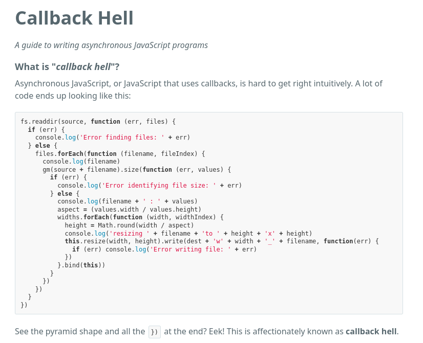

# 08-07:    ¿Qué es una promesa?

Una promesa, en JavaScript, es el objeto que conecta procesos de manera asíncrona, es decir, pudiendo postergar la respuesta de una función sin que la otra parte que la espera se detenga o bloquee el sistema. Este garantiza que, en un momento posterior, obtendrás un resultado, indistintamente del tiempo necesario para dicha tarea.

Es, algo así, como tener varios hilos de ejecución posibles.

Anterior a las promesas, en JavaScript clásico, también era posible manejar eventos asíncronos a través de callbacks, no sin problemas (de extensión de código, por ende, de errores en ejecución, o del propio mantenimiento/escalabilidad del código).

Un ejemplo sobre cómo trabajar eventos asíncronos en JavaScript clásico:
* Invocaciones constantes y anidadas
```js
funcionObienteDatos(() => {
    procesaDatos(() => {
        guardaDatos(() => {
            masFunciones(() => {
                yMuchasMasFunciones(() => {

                })
            })
        })
    })
})
```
* Por consecuencia, secuencias de promesas muy largas:
```js
funcionObtieneDatos();
    .then(procesaDatos);
    .then(guardaDatos);
    .then(masFunciones);
    .then(yMuchasMasFunciones)
```
 Esto era conocido como Infierno de Invocaciones (*callback hell*)




Para mejorar esto, las promesas introdujeron :
-> Simplifición de las operaciones asíncronas con métodos cómo `try` - `catch`.

-> Código más asimilable, legible, anidando sus operaciones en bloques de operaciones en cadena.

-> Un mejor manejo de errores, evitando fallos que no son alertados, lo que mejora el tiempo de desarrollo, el mantenimiento, escalabilidad.

***
## Estados de una Promesa

Una promesa puede varios estados, siendo, principalmente, esto:

1. `Pending` - Su estado inicial antes recibir una respuesta.
2. `Fullfilled` - Aceptación, operación finalizada con éxito, se recibe el valor deseado.
3. `Rejected` - Rechazo, operación no ha sido exitosa, retorna un error.


***
## Definiendo una Promesa (constructor `Promise`)
### Sintáxis de una promesa y manejo de resultados
```js

/*
Constructo Promise:

Creamos una promesa, asignada a la constante nuevoToDo
La promesa recibe una función con dos parámetros:
1. Resolve, si todo sale OK
2. Reject, si existe error
*/

const nuevoToDo = new Promise((resolve, reject) => {
    
    /*
    Añadimos un temporizador, configurado a 2 segundos (2000ms)
    */
    setTimeout(() => {

        /*
        Hacemos una petición GET a la API de JsonPlaceHolder,
        le pedimos un recurso concreto (/todos/1)
        */
        fetch('https://jsonplaceholder.typicode.com/todos/1')

            // Este .then convierte la respuesta a lo que queremos (un JSON)
            .then(response => response.json())
            // La promesa, o se resuelve, o se rechaza por error
            .then(data => resolve(data))
            .catch(error => reject(error))
    }, 2000);
});

/*
La constante nuevoToDo, si es invocada, mostrará el registro de eventos
de la promesa, es decir, esta no es la forma en la que manejaremos
los datos recibidos
*/
console.log(nuevoToDo)

/*
A través de constructores .then y .cathc es como se manejarán los datos
o posibles errores.
*/

nuevoToDo
    .then((todo) => {
        console.log(todo);
        return todo;
    })
    .catch((error) => {
        console.log('Error al obtener el JSON: ', error);
    });
    

/* El resultado obtenido es, efectivamente, el JSON solicitado:

{userId: 1, id: 1, title: 'delectus aut autem', completed: false}
*/
```
***
### Casos de Uso
#### Llamadas a API's
```js
fetch('https://jsonplaceholder.typicode.com/todos/1')
    .then(response => response.json())
    .then(data => resolve(data))
    .catch(error => reject(error))

```

#### Operaciones en paralelo usando `Promise.all`
Las capacidades multi-hilo de `Promise.all` suponen un concepto muy interesante.
Con este, después de asignar distintas peticiones GET a distintos recursos, con un tiempo de ejecución distinto, agrupamos su petición `.then - .catch` en un solo bloque.


```js
/*
1.
*/
const nuevoToDo = new Promise((resolve, reject) => {
    
    setTimeout(() => {
        fetch('https://jsonplaceholder.typicode.com/todos/1')
            .then(response => response.json())
            .then(data => resolve(data))
            .catch(error => reject(error))
    }, 2000);
});


/*
2. Creamos una segunda promesa con un timeout distinto.
*/
const nuevoToDos = new Promise((resolve, reject) => {
    
    setTimeout(() => {
        fetch('https://jsonplaceholder.typicode.com/todos/2')
            .then(response => response.json())
            .then(data => resolve(data))
            .catch(error => reject(error))
    }, 2000);
});

/*
3. Encapsulamos todas las promesas dispuestas a Promise.all
*/

Promise.all([nuevoToDo, nuevoToDos])
    .then(([toDo, toDos]) => {
        
        console.log('JSON de la Primera promesa: ', toDo );
        console.log('JSON de la Segunda promesa', toDos)

    })
    .catch((error) => {
        console.error('Error al obtener ambas promesas')
    }

)
```
***

Las promesas son la base para `Async/Await`, y esto lo vamos a desgranar en la siguiente página, 08-08_Async/Await.
